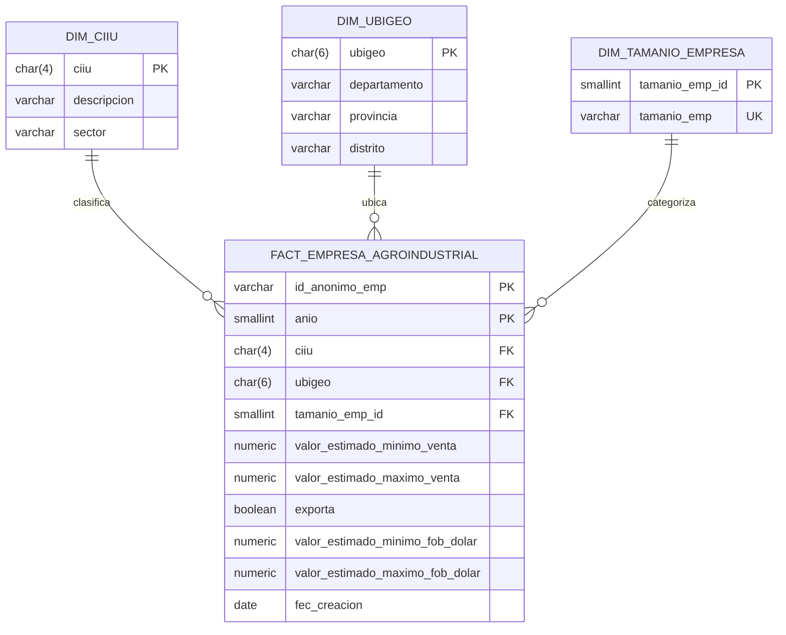

# Empresas Agroindustriales PRODUCE 2023

Titular: Victor Joseph Platero Maron

Proyecto de ingesta, modelado, infraestructura y analitica para el dataset **Empresas Agroindustriales a nivel nacional 2023** publicado por el Ministerio de la Produccion del Peru en la Plataforma Nacional de Datos Abiertos.

## Dataset

- Fuente: https://www.datosabiertos.gob.pe/dataset/empresas-agroindustriales-nivel-nacional-ministerio-de-la-produccion-produce
- Archivo principal: `data/Agroindustria_Nacional_2023.csv`
- Archivo normalizado: `data/agroindustria_nacional_2023_clean.csv`
- Entidad publicadora: Ministerio de la Produccion - PRODUCE.
- Alcance: listado anonimizado de empresas agroindustriales a nivel nacional.
- Periodo de datos: 2023.
- Registros perfilados: 14,224.
- Fecha de creacion del dataset informada en el archivo: 2024-12-18.
- Ultima modificacion del recurso en el portal: 2026-09-25.

El CSV original usa separador `;`, codificacion `latin1` y contiene cinco columnas vacias al final. El script `scripts/clean_dataset.py` conserva el archivo original y genera una copia limpia en UTF-8 con nombres de columna normalizados.

## Estructura

```text
.
├── .github/workflows/
│   ├── infra.yml
│   ├── setup.yml
│   └── deploy.yml
├── data/
│   ├── Agroindustria_Nacional_2023.csv
│   └── agroindustria_nacional_2023_clean.csv
├── docs/
│   ├── data_dictionary.md
│   ├── DataSet2_Agroindustria_Nacional_2023_Diccionario.xlsx
│   ├── Dataset1_Agroindustria_Nacional_2023_Metadatos.docx
│   └── secrets.md
├── liquibase/
│   └── db.changelog-master.yaml
├── powerbi/
│   ├── AgroindustriaProduce.pbip
│   ├── AgroindustriaProduce.pbix
│   ├── AgroindustriaProduce.Report/
│   ├── AgroindustriaProduce.SemanticModel/
│   ├── images/
│   └── README.md
├── scripts/
│   ├── build_powerbi_page_images.py
│   ├── clean_dataset.py
│   └── publish_powerbi_report.ps1
├── sql/
│   ├── 01_create_tables.sql
│   ├── 02_load_data.sql
│   └── 03_smoke_checks.sql
└── terraform/
    ├── main.tf
    ├── outputs.tf
    ├── variables.tf
    └── versions.tf
```

## Diccionario de datos

| Campo | Tipo destino | Descripcion |
|---|---:|---|
| id_anonimo_emp | varchar(32) | Identificador anonimizado de la empresa o unidad economica. |
| anio | smallint | Anio de origen de la informacion. |
| ciiu | char(4) | Codigo CIIU rev.3. |
| descciiu | varchar(200) | Descripcion del Clasificador Internacional Industrial Uniforme. |
| sector | varchar(100) | Sector economico. |
| ubigeo | char(6) | Codigo de ubicacion geografica. |
| departamento | varchar(50) | Departamento donde se ubica la empresa. |
| provincia | varchar(150) | Provincia donde se ubica la empresa. |
| distrito | varchar(150) | Distrito donde se ubica la empresa. |
| tamanio_emp | varchar(20) | Categoria empresarial: MICRO, PEQUENA, MEDIANA o GRAN EMPRESA. |
| valor_estimado_minimo_venta | numeric(14,2) | Valor estimado minimo de ventas anuales en soles. |
| valor_estimado_maximo_venta | numeric(14,2) | Valor estimado maximo de ventas anuales en soles. |
| exporta | boolean | Indicador de exportacion. |
| valor_estimado_minimo_fob_dolar | numeric(14,2) | Valor estimado minimo FOB anual en dolares americanos. |
| valor_estimado_maximo_fob_dolar | numeric(14,2) | Valor estimado maximo FOB anual en dolares americanos. |
| fec_creacion | date | Fecha de creacion del dataset. |

## Modelo de datos

Se propone un modelo dimensional simple para analitica en Power BI.



## Infraestructura

La infraestructura se define con Terraform y crea:

- Grupo de recursos Azure.
- Azure Database for PostgreSQL Flexible Server.
- Base de datos `agroindustria_dw`.
- Regla de firewall para el runner de GitHub Actions.

```mermaid
flowchart LR
    Dev[Repositorio GitHub] --> Actions[GitHub Actions]
    Actions --> Terraform[Workflow infra.yml Terraform]
    Terraform --> AzureRG[Azure Resource Group]
    AzureRG --> Postgres[Azure Database for PostgreSQL Flexible Server]
    Actions --> Liquibase[Workflow setup.yml Liquibase]
    Liquibase --> Postgres
    Postgres --> PowerBI[Power BI semantic model]
    Actions --> Deploy[Workflow deploy.yml]
    Deploy --> Service[Power BI Service Workspace]
    Service --> User[patcuadrosq@upt.pe]
```

## Workflows

### `infra.yml`

Ejecuta Terraform para crear el servidor PostgreSQL y la base de datos en Azure.

Secretos necesarios:

- `AZURE_CREDENTIALS`
- `POSTGRES_ADMIN_PASSWORD`

Variable opcional:

- `AZURE_LOCATION`

### `setup.yml`

Permite configurar la base de datos, ejecutar el changelog Liquibase y validar la carga.

Secretos necesarios:

- `AZURE_CREDENTIALS`
- `AZURE_RESOURCE_GROUP`
- `AZURE_POSTGRES_SERVER`
- `DB_HOST`
- `DB_NAME`
- `DB_USER`
- `DB_PASSWORD`

### `deploy.yml`

Publica `powerbi/AgroindustriaProduce.pbix` en Power BI Service, registra la URL como artefacto de GitHub Actions y agrega acceso de lectura para `patcuadrosq@upt.pe`.

Secretos necesarios:

- `POWERBI_TENANT_ID`
- `POWERBI_CLIENT_ID`
- `POWERBI_CLIENT_SECRET`
- `POWERBI_WORKSPACE_ID`

## Ejecucion local

Limpiar dataset:

```bash
python scripts/clean_dataset.py
```

Crear tablas y cargar con `psql`:

```bash
psql "host=<host> port=5432 dbname=agroindustria_dw user=<user> sslmode=require" -f sql/01_create_tables.sql
psql "host=<host> port=5432 dbname=agroindustria_dw user=<user> sslmode=require" -f sql/02_load_data.sql
psql "host=<host> port=5432 dbname=agroindustria_dw user=<user> sslmode=require" -f sql/03_smoke_checks.sql
```

Ejecutar con Liquibase:

```bash
liquibase \
  --changelog-file=liquibase/db.changelog-master.yaml \
  --url="jdbc:postgresql://<host>:5432/agroindustria_dw?sslmode=require" \
  --username="<user>" \
  --password="<password>" \
  update
```

## Reporte Power BI

El directorio `powerbi/` incluye un proyecto Power BI (`.pbip`) con modelo semantico base y una especificacion de reporte con:

- Dashboard 1: resumen nacional.
- Dashboard 2: exportaciones.
- Reporte de tabla: detalle empresarial con filtro por `tamanio_emp`.

Para publicar desde GitHub Actions se incluye `powerbi/AgroindustriaProduce.pbix`. Si se actualiza el diseno desde Power BI Desktop, guardar la nueva version con el mismo nombre y ejecutar `deploy.yml`.

## Publicacion del reporte

El requisito indica compartir el reporte publicado con la cuenta `patcuadrosqœupt.pe`. Ese texto parece tener `œ` en lugar de `@`; Power BI normalmente requiere un usuario/correo valido, por lo que se debe confirmar si la cuenta correcta es `patcuadrosq@upt.pe`.

Para publicar el reporte hay dos opciones:

1. Publicacion manual: abrir `powerbi/AgroindustriaProduce.pbip` en Power BI Desktop, conectarlo a PostgreSQL, guardar como `powerbi/AgroindustriaProduce.pbix`, usar **Publicar** hacia el workspace de Power BI y compartir el reporte con la cuenta indicada.
2. Publicacion automatizada: configurar los secretos de Power BI indicados en `docs/secrets.md` y ejecutar el workflow `deploy-powerbi`.

Para que un tercero ejecute la publicacion automatizada se necesita:

- Acceso a un workspace de Power BI.
- `POWERBI_TENANT_ID`.
- `POWERBI_CLIENT_ID`.
- `POWERBI_CLIENT_SECRET`.
- `POWERBI_WORKSPACE_ID`.
- El archivo final `powerbi/AgroindustriaProduce.pbix`.
- Confirmacion del correo correcto para compartir el reporte.

## URLs

- URL GitHub del proyecto: https://github.com/VictorPlatero/Examen_Unidad_I_IN
- URL del reporte publicado: pendiente hasta ejecutar `deploy.yml` con credenciales de Power BI.

## Notas

- No se incluyen credenciales ni contrasenas en el repositorio.
- La cuenta solicitada para compartir el reporte aparece como `patcuadrosqœupt.pe`; en la automatizacion se uso `patcuadrosq@upt.pe` como correo probable. Ajustar si el correo correcto es distinto.
- Microsoft documenta PBIP como formato de proyecto basado en archivos de texto y Power BI Desktop como mecanismo para guardar PBIP/PBIX.
